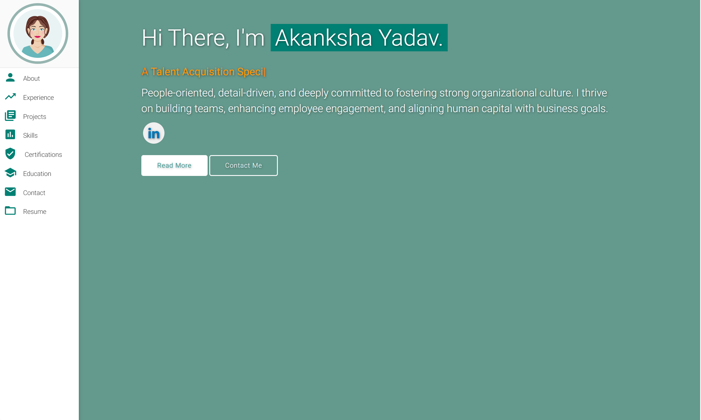

# Akanksha Yadav-Portfolio
Dual-track profile support (Tech + Management)
# 👩‍💼 Akanksha Yadav – Human Resources Portfolio Website

> A personal, responsive HR Portfolio website built with HTML, CSS, and JavaScript — designed to showcase expertise in Talent Acquisition, HR Tools, Projects, and Certifications with modern UI, live project demos, and professional details.

---

## 🖼️ Preview

---

## 📌 Project Overview

The **Akanksha Yadav HR Portfolio** is a personal branding website built specifically to present skills, tools, projects, and experiences in **Human Resource Management** in a visually compelling way.

This portfolio acts as a **digital business card + resume + project showcase** that allows HR professionals to showcase both traditional HR competencies and tech-savvy initiatives like automation tools, productivity apps, and strategic people operations.

Whether you're a hiring manager, recruiter, mentor, or collaborator — this portfolio provides a complete snapshot of Akanksha's professional journey.

---

## 🚀 Live Project

➡️ [**Live Portfolio Website**](https://code-archer-tech.github.io/Akanksha-Yadav-Portfolio/)

Built with GitHub Pages – auto-deploys with every update.

---

## 👩‍💼 Who Is This For?

This portfolio was created for:

- 💼 **HR Professionals** who want to stand out with a digital presence
- 🎓 MBA/BBA students showcasing HR internships, tools, and projects
- 🤝 Recruiters and collaborators looking to quickly assess skills & experience
- 📲 Mobile-first HR professionals who want their portfolio responsive & modern

---

## 🔧 Technologies Used

| Area           | Tools / Technologies                                         |
|----------------|--------------------------------------------------------------|
| 🌐 Frontend     | HTML5, CSS3, JavaScript, Materialize CSS                    |
| 🎨 UI Styling   | Google Fonts, FontAwesome Icons, Custom Media Queries       |
| 🛠️ Dev Tools    | VS Code, Git, GitHub                                         |
| ☁️ Deployment   | GitHub Pages                                                 |
| 📁 Assets       | Logos, Icons, Screenshots, SVGs                             |

---

## 📚 Sections Included

### 📌 1. Introduction (Hero Section)
- Name, designation (`HR Professional`)
- Typing animation (Talent Acquisition, HR Operations, etc.)
- Welcome message with purpose

### 👩‍💼 2. About Section
- Personal summary
- Passion for HR transformation, employee engagement, & strategy
- Soft skills and value proposition

### 🧰 3. Skills Section (with icons & groupings)
- ✅ Core HR Skills (TA, Onboarding, Payroll, Strategy, etc.)
- 💬 Soft Skills (Empathy, Communication, Critical Thinking)
- ⚙️ HR Tools (Naukri, Zoho People, LinkedIn Recruiter)
- 🤖 AI & Productivity (ChatGPT, Google Docs, Grammarly, Canva)
- 💬 Communication (Zoom, Gmail, Slack, Google Meet, Teams)

### 📜 4. Education Section
- 🎓 BBA – Babasaheb Bhimrao Ambedkar University (Central)
- 🎓 MBA (Pursuing) – Dr. A.P.J. Abdul Kalam Technical University
- 🎯 Relevant Coursework: HRM, OB, T&D, MIS, Ethics, Management

### 🧾 5. Projects Section
- Resume Screening Automation using Google Sheets (highlighted)
- Cactus Nursery Website, FastBurger, Portfolio Site (optional)
- Action buttons: Live Link + Source Code

### 🎓 6. Certifications
- Internship certificate previews
- Descriptions of role, tools, achievements
- "View Certificate" button (opens full-size proof)

### 📬 7. Contact Section
- Gmail, LinkedIn, GitHub buttons with hover tooltips
- Mobile & Location info

### 👣 8. Footer
- Social media logos
- Copyright info
- "Designed with ❤️ by Anup Yadav"

---

## 🧪 Project Features

- 💻 Fully Responsive for all devices
- 📑 Real-time Resume Screening Project (for HR workflows)
- 🎯 Focused on HR Branding, not generic dev portfolio
- 🖼️ Logo branding for every university and certificate
- 🧠 Skill categorization for recruiter-friendly scanning
- 🏷️ Minimal use of JavaScript for maximum performance

---

## 📂 Folder Structure

